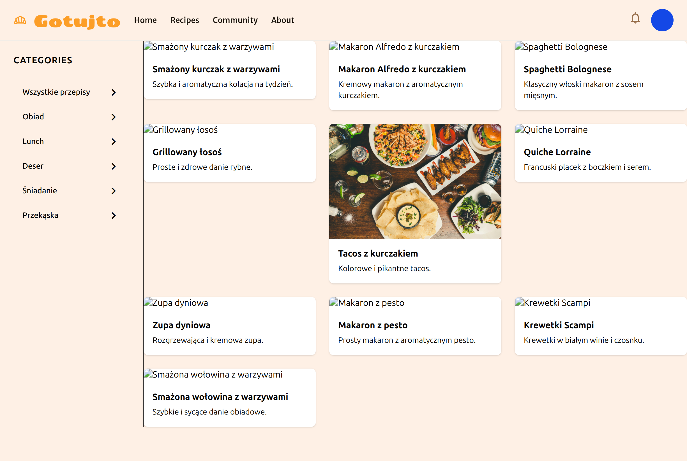
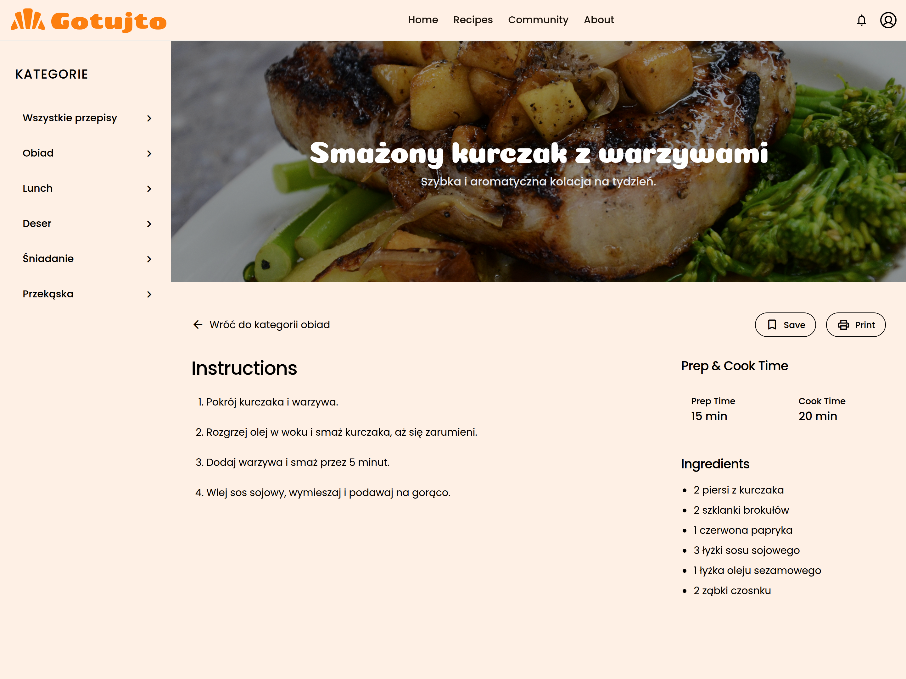

# Gotujto - Modern Recipe Library

Gotujto is a modern, minimalist recipe library web application designed to help users **browse, search, and organise recipes** in a clean and intuitive interface. 
The project began as a static prototype (HTML + Tailwind CSS) and is evolving into a full React-based web application with routing, dynamic data, and user interactivity.

 <br/>
<br/>
 <br/>
<br/>
<br/>

---

## Screenshots

| Recipe Library                                | Recipe Detail                               |
| --------------------------------------------- | ------------------------------------------- |
|  |  |

---

## Features (current & planned)

- Recipe Library - clean grid layout of curated recipes.
- Search bar - filter by recipe name, ingredients, or tags.
- Categories - organise recipes (breakfast, lunch, dinner, snacks, etc.).
- Recipe detail view - ingredients, instructions, nutrition info.
- Favourites - save recipes (via localStorage or backend later).
- Responsive UI - mobile-first, Tailwind-based.
- Dark mode (planned).
- Community features (future: sharing, comments, ratings).

---

## Tech Stack

### Current

- **Frontend**:
  - [React](https://react.dev/) (via Vite for fast bundling)
  - [React Router](https://reactrouter.com/) (routing between library & recipe details)
  - [TailwindCSS](https://tailwindcss.com/) for utility-first styling
  - Google Fonts (Epilogue) & Material Icons

- **Data**:
  - Static JSON for recipes (easy to expand later).

- **Tooling**:
  - Node.js + npm/yarn for dependency management
  - ESLint + Prettier (recommended for consistency)

### Possible Backend (future)

- Node/Express API with MongoDB or PostgreSQL
- Authentication (Auth0, Firebase, or custom JWT)
- Cloud hosting (Vercel/Netlify for frontend, Railway/Render for backend)

---

## Setup & Development

1. Clone repo:

   ```bash
   git clone https://github.com/yourusername/gotujto.git
   cd gotujto

   ```

2. Install dependencies:

   ```bash
   npm install

   ```

3. Start dev server:

   ```bash
   npm run dev

   ```

4. Open in browser:
   ```bash
   http://localhost:5173
   ```

---

## App Logic

- Homepage (Recipe Library)
  Fetch recipes from a JSON file and render them with RecipeCard.
  Filters: search query + category.

- Recipe Detail View
  Dynamic route (/recipe/:id), display full details.

- Favorites
  Save recipe IDs to localStorage → highlight saved ones.

- Expansion
  Replace static JSON with API calls. Add forms for user-generated content.

---

## Skills Gained as a Developer

**Current development**:

- Building responsive layouts with TailwindCSS

- Setting up a React project with Vite

- component-driven architecture (cards, lists, details)

- Client-side routing with React Router

- Managing local state and JSON data

**Future skills with expansion**:

- API integration (fetch, axios, custom backend)

- State management (Redux, Zustand, or Context API)

- Authentication & authorization flows

- Database design for recipes, users, favourites

- Deployment & CI/CD pipelines

- Accessibility improvements (ARIA, keyboard nav, color contrast checks)

---

## Expansion Ideas

- PWA (Progressive Web App) for offline recipe access

- Meal planner & shopping list generator

- User profiles with custom recipe uploads

- Ratings, reviews, and social sharing

- AI integration (suggest recipes based on ingredients you have)

- Multilingual support (e.g. Polish & English)

---

## Future Tech Choices

### Moving to TypeScript

**Pros**:

- Type safety → fewer runtime bugs

- Better DX (autocompletion, refactoring)

- Easier scaling with more contributors

**Cons**:

- More boilerplate for types/interfaces

- Slower prototyping at the early stage

---

### Migrating to Next.js

**Pros**:

- Server-side rendering (SEO-friendly)

- File-based routing → simpler structure

- API routes for backend-lite functionality

- Easy deployment on Vercel

**Cons**:

- Added complexity if the project stays small

- Lock-in to Next.js conventions

---

## Challenges

- Keeping UI minimal while adding features (avoid bloat)

- Managing recipe data schema (ingredients, steps, nutrition)

- SEO optimisation for recipe content

- Handling images efficiently (CDN, optimisation)

- Long-term: deciding when to move from static JSON → database

---

## License

MIT – feel free to fork, use, and contribute.
